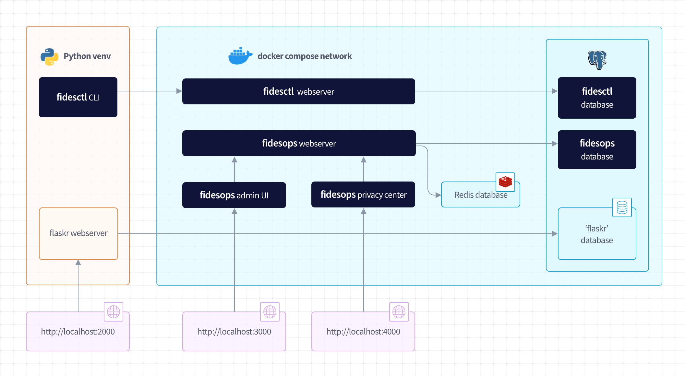

# Fides Demo Project

This is a basic Flask app that demonstrates the use of [`fidesctl`](https://github.com/ethyca/fides) and [`fidesops`](https://github.com/ethyca/fidesops) as part of a "real" project that uses:

* Flask to run a web server simulating a basic e-commerce application
* PostgreSQL as an application database
* SQLAlchemy to connect to the database
* `fidesctl` to declare privacy manifests and evaluate policies
* `fidesops` to execute privacy requests against the Flaskr database

The Flask app itself is simply the [Flask tutorial app](https://flask.palletsprojects.com/en/2.0.x/tutorial/) modified to simulate an e-commerce marketplace, in order to highlight some basic examples of data categories that might be stored in a "real" user-facing application.



## Requirements

To run this project, first ensure you have the following requirements installed and running on your machine:

* Docker 12+
* Python 3.7+
* Make
* `pg_config` (for our Python project: installed via `brew install libpq` or `brew install postgres` on Mac)

## Getting Started

To create the project `venv` and install requirements, run:
```
make install
```

Once installed you can start the server with:
```
make server
```

Run the project tests with:
```
make test
```

## Example Application: "Flaskr"

This example application is meant to simulate a basic e-commerce marketplace where users can register and purchase products from each other. Using the website you can:
* Register a new user
* Login as a user
* Post a "product"
* Delete/update products you posted
* Submit a purchase to a product

The schema itself is designed to highlight a few *very* simple examples of how identifiable data might get stored in even a trivial web application like this. The sample data below shows what this looks like:
```
flaskr=# SELECT * FROM users;
 id |     created_at      |       email       |              password              | first_name | last_name 
----+---------------------+-------------------+------------------------------------+------------+-----------
  1 | 2020-01-01 00:00:00 | admin@example.com | pbkdf2:sha256:260000$O87nanbSkl... | Admin      | User
  2 | 2020-01-03 00:00:00 | user@example.com  | pbkdf2:sha256:260000$PGcBy5NzZe... | Example    | User
(2 rows)

flaskr=# SELECT * FROM products;
 id |     created_at      | seller_id |       name        |             description              | price 
----+---------------------+-----------+-------------------+--------------------------------------+-------
  1 | 2020-01-01 12:00:00 |         1 | Example Product 1 | A description for example product #1 |    10
  2 | 2020-01-02 12:00:00 |         1 | Example Product 2 | A description for example product #2 |    20
  3 | 2020-01-03 12:00:00 |         2 | Example Product 3 | A description for example product #3 |    50
(3 rows)

flaskr=# SELECT * FROM purchases;
 id |     created_at      | product_id | buyer_id |    street_1    | street_2 |    city     | state |  zip  
----+---------------------+------------+----------+----------------+----------+-------------+-------+-------
  1 | 2020-01-04 12:00:00 |          1 |        2 | 123 Example St | Apt 123  | Exampletown | NY    | 12345
(1 row)
```

## Tutorial Steps

The full walkthrough for setting up this demo project can be found in two parts:

1. Setting up `fidesctl`: https://ethyca.github.io/fides/tutorial/
1. Setting up `fidesops`: https://ethyca.github.io/fidesops/tutorial/

You can also recreate the tutorial steps by checking out the different git tags:

1. `git checkout tutorial-start` to start from the beginning with just the basic Flask app
1. `git checkout fidesctl-start` to rewind to when `fidesctl` is installed but not used
1. `git checkout fidesctl-manifests` to start from an initial set of `fidesctl` manifests
1. `git checkout fidesctl-add-google-analytics` to view an example of a `fidesctl` manifest that fails a policy
1. `git checkout fidesctl-demo` to view the working demo of `fidesctl evaluate` against a few example manifests
1. `git checkout fidesops-start` to have `fidesops` installed but not used
1. `git checkout fidesops-demo` to view the final version with `fidesops` executing privacy requests

## License

This project is licensed under the Apache Software License Version 2.0.
